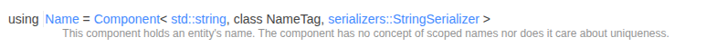
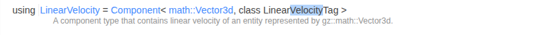
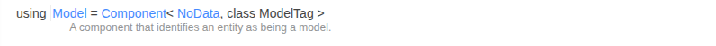
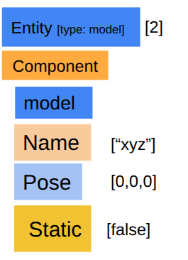
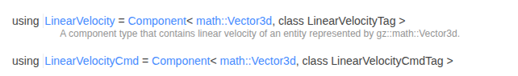

# Common Used System Plugin API

important part in api doc:<br>
    - [gz::sim](https://gazebosim.org/api/sim/9/namespacegz_1_1sim.html){target=_blank}<br>
    - [gz::sim::EntityComponentManager](https://gazebosim.org/api/sim/9/classgz_1_1sim_1_1EntityComponentManager.html){target=_blank}<br>
    - [gz::sim::components](https://gazebosim.org/api/sim/9/namespacegz_1_1sim_1_1components.html){target=_blank}<br>


### Understand Component 

```c++
using X = Component<DataType, class Tag>;

//        or 

using X = Component<DataType, class Tag, Serializer>;
```

to access component: ```components::X``` , ```X``` is the component Name <br>
Datatype: data type of that component <br>
Serializer: use for data transfer (not so important) <br>










access:<br> 
- ```components::Name```<br>
- ```components::LinearVelocity```<br>
- ```components::Model```


<br>
<br>
<br>

## System Plugin Steps
  


### 1. Find The Entity


We will take help of components to find entity integer value like:

  - has `Name` component of value `xyz`
  - has both `Entity` and `Name` components


  <details>
   <summary>a. plugin is directly attached to entity</summary>
  
  
    in world file .sdf
    ```xml
     <model>
        ...

        <plugin>..... </plugin>   
     </model>
    ```
   
    code

    ```c++
     void MoveModel::Configure(const Entity &_entity, const std::shared_ptr<const sdf::Element> &_sdf,
                        EntityComponentManager &_ecm,
                        EventManager &/*_eventMgr*/){
            // _entity --> is the entity of model
            entity = _entity;
    }
    ```
  </details>

  <details>
  <summary>b. search the entity by its name</summary>
  
   ```c++
      std::string name = _ecm.Component<components::Name>(entity)->Data();
   ```

   ```c++
   auto entityOpt = _ecm.EntityByName("abc");
   entity = entityOpt.value()
   ```
  </details>
  


  <details>
  <summary>c. find multiple entity</summary>
  

  ```c++

    //check for such components which has Light, Name components
    _ecm.Each<components::Light, components::Name>(
      [&](const Entity &_entity,
          const components::Light *,
          const components::Name *_name) -> bool
      {
        this->lightEntites.push_back(_entity);
        // gzmsg << "Found light: " << _name->Data()
        //       << " (entity " << _entity << ")\n";
        return true;
      });
  ```

  </details>


### 2. Read/Write on the Component value


...``Cmd`` means to command to change that container value like ```LinearVelocityCmd```, ```WorldPoseCmd```, 	```VisualCmd```

#### Write
 <details>
   <summary>a. SetComponentData</summary>
   
   ```c++
   const gz::math::Vector3d vel(0.0, 0.0, this->zVelocity);
   _ecm.SetComponentData<components::LinearVelocityCmd>(this->targetEntity,{vel});
   ```
 </details>

  <details>
   <summary>b. mutable component</summary>
   
   ```c++
   auto velComp = _ecm.Component<components::LinearVelocityCmd>(this->targetEntity);
   velComp->Data() = vel;
   ```
 </details>


