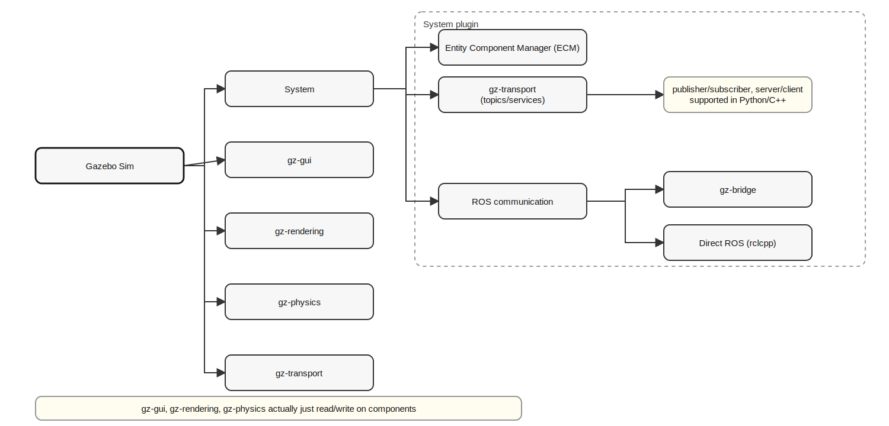
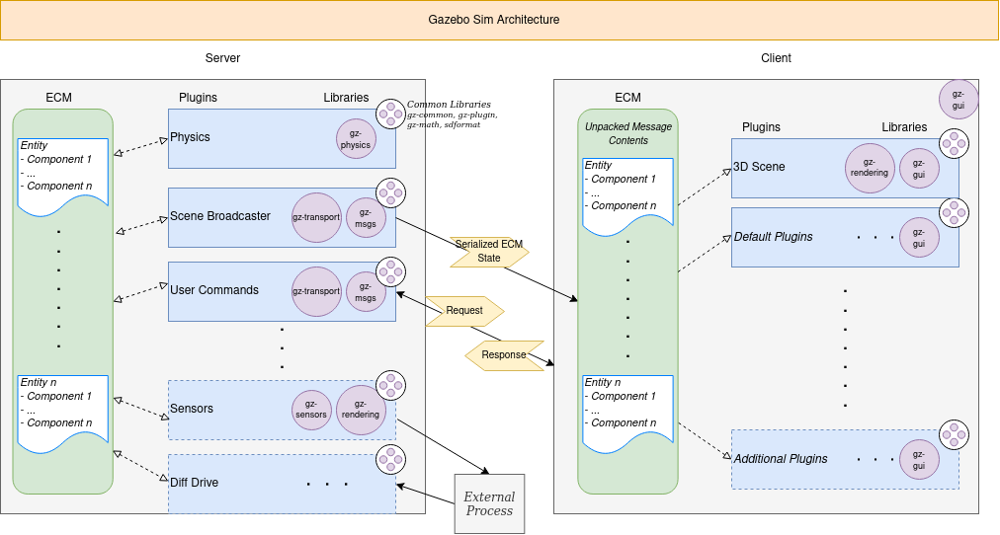

# Gazebo Sim Structure Plugin Perspective

code/git repo for reference: 
- [gz-system](https://github.com/gazebosim/gz-sim/tree/gz-sim10/src/systems) 
- [gz-physics](https://github.com/gazebosim/gz-physics) 
- [gz-gui](https://github.com/gazebosim/gz-gui) 
- [gz-transport](https://github.com/gazebosim/gz-transport) 
- [gz-rendering](https://github.com/gazebosim/gz-rendering) 

will mainly focus on system plugin because they are main & other have there own code base to do things like

- ``gz-physics`` have code to calculation physics base on different physics engine(eg: dart) but at the end read/write on the components
- ``gz-gui`` & ``gz-rendering`` render scene or have gui made using Qt but end it also read/write on the system components

same thing visible in gazebo sim architecture

