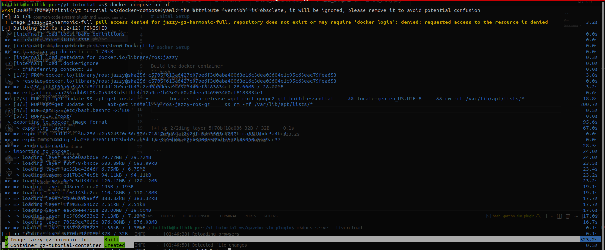

# Inital Setup for Tutorial

<iframe
  width="960"
  height="540"
  src="https://www.youtube.com/embed/qMsTqpHuw3A?si=sO0ypQ5GnpoyV1QJ"
  title="Entity Component System Explained"
  frameborder="0"
  allow="accelerometer; autoplay; clipboard-write; encrypted-media; gyroscope; picture-in-picture"
  allowfullscreen>
</iframe>

## Prerequisites
Common:<br>
- Git<br>
- A Linux environment (Ubuntu recommended)<br>

There are 2 way to do it:

## 1. Without Using docker

[gazebo-sim-plugins-tutorial github](https://github.com/Hrithik-verma/gazebo-sim-plugins-tutorial)

```text
gazebo-sim-plugins-tutorial/
├── standalone_gz_sim_plugins/
│   ├── plugin_name_1/              # Standalone Gazebo Sim system plugin
│   ├── plugin_name_2/              # Standalone Gazebo Sim system plugin
│   └── ...                         # More standalone plugins
│
├── ros2_ws/
│   ├── src/
│   │   ├── yt_tutorial_gazebo_ros/      # ROS 2 Gazebo launch & integration
│   │   └── tutorial_gazebo_plugins/     # ROS 2 Gazebo plugins
│   └── ...                               # ROS 2 build, install, log folders
│
└── README.md
```

### Needed
- ROS 2 installed on host
- Gazebo Sim installed on host
- Build tools (CMake / make)
- colcon (for ROS 2 workspace)


NOTE:<br>
- Make sure you already have ROS 2 + Gazebo Sim installed on your system. <br>
- The main difference vs Docker is simply where your X path points.<br>

Clone:
```bash
git clone https://github.com/Hrithik-verma/gazebo-sim-plugins-tutorial.git
cd gazebo-sim-plugins-tutorial
```


### Build & Run


#### A) Standalone Gazebo Sim Plugins
1) Go to a standalone plugin folder:
```bash
cd <path-to>/gazebo-sim-plugins-tutorial/standalone_gz_sim_plugins/<plugin_name>
```

2) Build:
```bash
mkdir build && cd build
cmake ..
make
cd ..
```

3) Export plugin path (so Gazebo Sim can find it):
```bash
export GZ_SIM_SYSTEM_PLUGIN_PATH=$(pwd)/build
```

4) Launch Gazebo Sim with an SDF:
```bash
gazebo sim -v 4 <sdf_file_path>.sdf
```

Notes:
- "-v 4" prints debug logs (useful while developing)
- If Gazebo can’t find the plugin, re-check GZ_SIM_SYSTEM_PLUGIN_PATH and that build succeeded.

<br>

#### B) ROS 2 Workspace (ros2_ws)

1) Go to the ROS 2 workspace:
```bash
cd <path-to>/gazebo-sim-plugins-tutorial/ros2_ws
```

2) Build ROS 2 packages:
```bash
colcon build --symlink-install
```

3) Source the workspace:
```bash
source install/setup.bash
```

4) Launch:
```bash
ros2 launch yt_tutorial_gazebo_ros <launch_file>.launch.py
```


<br>
<br>

## 2. Using Docker

[ros2-jazzy-gazebo-harmonic-docker github](https://github.com/Hrithik-verma/ros2-jazzy-gazebo-harmonic-docker)


```text
ros2-jazzy-gazebo-harmonic-docker/
├──gazebo-sim-plugins-tutorial/   # other repo containing gazebo sim & ros2 launch
|    ├─── standalone_gz_sim_plugins/
│    |     ├── plugin_name_1/              # Standalone Gazebo Sim system plugin
│    |     ├── plugin_name_2/              # Standalone Gazebo Sim system plugin
│    |     └── ...                         # More standalone plugins
│    |
|    ├── ros2_ws/
│           ├── src/
│           │   ├── yt_tutorial_gazebo_ros/      # ROS 2 Gazebo launch & integration
│           │   └── tutorial_gazebo_plugins/     # ROS 2 Gazebo plugins
│           └── ...                               # ROS 2 build, install, log folders
│
├── README.md                    
│
├── Dockerfile   # docker file to make the docker image
├── docker-compose.yaml # docker container setup details 
│
└── README.md
```

### Clone
```bash
git clone https://github.com/Hrithik-verma/ros2-jazzy-gazebo-harmonic-docker.git
git submodule update --init --recursive
```

### Docker Setup 
Build the docker container
```bash
cd ros2-jazzy-gazebo-harmonic-docker
docker compose up -d
```

output:<br>


```
[+] up 2/2ding layer 5f70bf18a086 32B / 32B     0.1s
 ✔ Image jazzy-gz-harmonic-full    Built        323.2s 
 ✔ Container gz-tutorial-container Created     

 ```                                                 

check image
```bash
docker images
```

output:<br>
it shows image we build using ```yt_tuturial_ws/Dockerfile``` 
````
jazzy-gz-harmonic-full:latest             67661f9f23be       3.81GB             0B    U   
````

check image
```bash
docker ps
```

output:<br>
output current running container
```
docker ps
CONTAINER ID   IMAGE                           COMMAND                  CREATED          STATUS          PORTS     NAMES
61314940b998   jazzy-gz-harmonic-full          "/ros_entrypoint.sh …"   10 minutes ago   Up 10 minutes             gz-tutorial-container
```

### Run Container

```Important:``` container need to have display access for gazebo gui, rviz gui
```bash
xhost +
```

go inside the container
```bash
docker exec -it gz-tutorial-container bash
```

### Check Container

To check if container is running or not.
Container name not in the list that means it not running
```
docker ps
```

start
```bash
docker start gz-tutorial-container
```
stop
```bash
docker stop gz-tutorial-container
```

### Docker Volume Shared

In ```ros2-jazzy-gazebo-harmonic-docker/docker-compose.yaml``` 

```
 volumes:
      - /tmp/.X11-unix:/tmp/.X11-unix:rw
      - ./gazebo-sim-plugins-tutorial/ros2_ws:/root/ros2_ws
      - ./gazebo-sim-plugins-tutorial/standalone_gz_sim_plugins:/root/standalone_gz_sim_plugins
```

```X11:``` for display access <br>
```ros2_ws```: entire **ros2_ws** is mounted inside ***root/ros2_ws***. So any changes we make in ros2_ws will be reflected inside the container.
```standalone_gz_sim_plugins``` similary ***standalone_gz_sim_plugins*** is mounted inside ***root/standalone_gz_sim_plugins***


### Troubleshooting

GUI / Gazebo window not opening (Docker):
- Ensure you ran: xhost +
- Ensure DISPLAY is correctly passed into container (depends on your docker setup)
- Display id is same in host & container
host & docker container should have same ``id``
```bash
echo $DISPLAY
```
output eg:
```bash
$ echo $DISPLAY
:0
```

if not export same display id in host & docker container
```bash
export DISPLAY=:0
```

