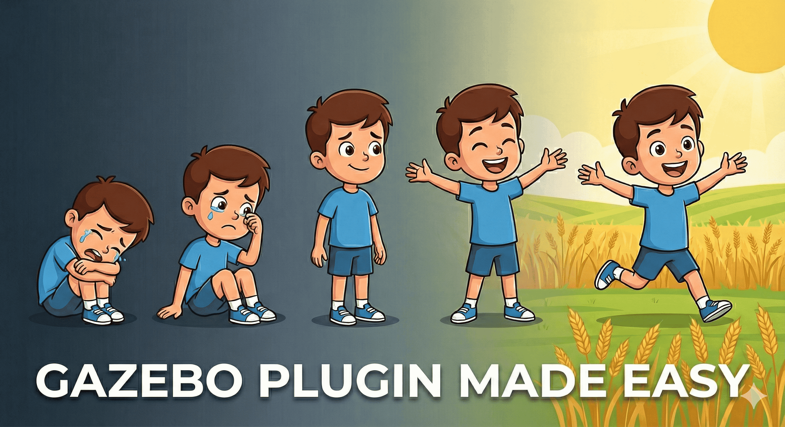

# Introduction




    🚀 Lets Make Gazebo Sim Plugin Easy


<u style="color:#d60b99; font-size:1.6rem; font-weight:600;">
  Motivation
</u><br>
As a beginer I personally find gazebo plugin to be very hard. In 2022,I made a bunch of tutorial for gazebo classic similary will do for gazebo sim. I always thought:<br>

- what has changed from gazebo classic to sim?<br>
- how gazebo plugin internally works?<br>
- what is ECS? what are entity/components?<br>
- where/how to read gazebo sim doc & find useful info<br>
- how to know which function to use?<br>


Finally, I'm here to answer all what where & why. I feel so happy that I can share it with the world. Though this tutorials we decode all the secrets 🤫. We will learn every line of code in detail😍. 


<div class="red-quote">
"Difficult part of gazebo plugin is not logic building rather
how, when & what function, msg, class & Components(ECS) to use to code it.
"
</div>


<u style="color:#5ac628; font-size:1.6rem; font-weight:600;">
  Prerequisites
</u><br>
These are certain thing you need to know even before watching these tutorial series like ```ros2```, basic of ```gazebo sim```, ```c++17``` etc. Some good reference are:

1. [OOPS in C++](https://www.youtube.com/playlist?list=PL43pGnjiVwgTJg7uz8KUGdXRdGKE0W_jN){target=_blank}<br>
At least some know of class, inheritance,  constructor,  virtual function

2. [Smart Pointers](https://www.youtube.com/watch?v=e2LMAgoqY_k){target=_blank}<br>
As we advance you will see will see that gazebo uses smart pointer a lot to point to classes & function

3. [Entity Component System (ECS)](https://youtu.be/JxI3Eu5DPwE?si=B6OKASU5pFYKTKPh){target=_blank}<br>
ECS is the building block of gazebo sim & ecs has be used in game engine for a long time now. Its better if you have some basic understanding of it.


A recommendation to download [Visual Studio Code](https://www.youtube.com/watch?v=uYE0XrM-VZA){target=_blank} 