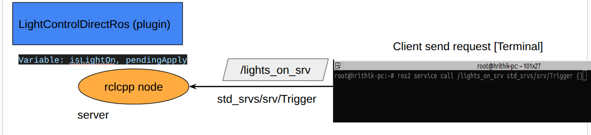

# LightControlDirectROS Plugin

<iframe
  width="960"
  height="540"
  src="https://www.youtube.com/embed/H_aGfA4a22U?si=WDEDc8hw_yr_rGCv"
  title="Gazebo Sim Structure Plugin Perspective"
  frameborder="0"
  allow="accelerometer; autoplay; clipboard-write; encrypted-media; gyroscope; picture-in-picture"
  allowfullscreen>
</iframe>


We are going to use rclcpp to control light on/off same system plugin as [LightControl Plugin](light-control-system-plugin.md) by ros2 service of type ```std_srvs/srv/Trigger```




<br>
<br>

## Why Can't We Use gz-ros-bridge?

there are only limited set of msg supported for ros gz brige. ```Empty msg``` service is not added yet.


more here details here in the doc [list of supported msg](https://docs.ros.org/en/jazzy/p/ros_gz_bridge/){target=_blank}


## Threading
threading logic is extact same with [MoveModelDirectRos] Plugin move-model-direct-ros-plugin.md


```c++
// --- ROS 2 Initialization ---
// Initialize ROS 2 (safe to call multiple times)
if (!rclcpp::ok())
{
// Pass in dummy arguments.
rclcpp::init(0, nullptr); 
}

// Create the ROS 2 node
this->ros_node_ = std::make_shared<rclcpp::Node>("gz_light_control_ros_plugin");
// this->executor_ = std::make_shared<rclcpp::executors::MultiThreadedExecutor>();
this->ros_executor_ = std::make_shared<rclcpp::executors::SingleThreadedExecutor>();
this->ros_executor_->add_node(this->ros_node_);

//lamda function having ros spin
auto ros_thread_spin = [this]() 
{ 
this->ros_executor_->spin(); 
};

//make a new thread for ros spin
this->cpp_thread = std::thread(ros_thread_spin);

```

## Code
entire code is same just we added ros2 service 

```c++
// Create ROS 2 service using the same name from SDF, e.g. "/lights_on_srv"
  this->ros_srv_ = this->ros_node_->create_service<std_srvs::srv::Trigger>(
    this->serviceName,
    std::bind(&LightControlDirectRos::RosToggleCallback,
              this,
              std::placeholders::_1,
              std::placeholders::_2));


```

callback function
```c++

void LightControlDirectRos::RosToggleCallback(
    const std::shared_ptr<std_srvs::srv::Trigger::Request> /*req*/,
    std::shared_ptr<std_srvs::srv::Trigger::Response> res)
{
  // Flip state and indicate that PreUpdate must apply this change once
  this->isLightOn = !this->isLightOn;
  this->pendingApply = true;

  gzmsg << "[LightControlDirectRos] ROS toggle. isLightOn = "
        << std::boolalpha << this->isLightOn << std::endl;

  res->success = true;
  res->message = this->isLightOn ? "Light turned ON" : "Light turned OFF";
}


```

## Full Plugin


<details>
   <summary>.sdf plugin part</summary>

```xml
<plugin
    filename="LightControlDirectRos"
    name="gz::sim::LightControlDirectRos">

    <on_off_ros_service_name>lights_on_srv</on_off_ros_service_name>
</plugin>
```

</details>   


<details>
    <summary> .hh</summary>

```c++
#ifndef LIGHT_CONTROL_ROS_PLUGIN_HH_
#define LIGHT_CONTROL_ROS_PLUGIN_HH_

#include <gz/sim/System.hh>
#include <gz/sim/components/Name.hh>
#include <gz/sim/components/Light.hh>
#include <gz/math/Color.hh>
#include <gz/sim/Light.hh>

#include <gz/msgs.hh>
#include <gz/transport.hh>
#include <rclcpp/rclcpp.hpp>
#include <std_srvs/srv/trigger.hpp>
#include <thread>


#include <vector>

namespace gz
{
namespace sim
{
class LightControlDirectRos : public System, public ISystemPreUpdate, public ISystemConfigure
{
public:
  // Constructor
  LightControlDirectRos() = default;

  void Configure(const Entity &_entity,
                   const std::shared_ptr<const sdf::Element> &_sdf,
                   EntityComponentManager &_ecm,
                   EventManager &_eventMgr) override;

  // ISystemPreUpdate method
  void PreUpdate(const UpdateInfo &_info, EntityComponentManager &_ecm) override;

private:
  // Function to find the light entity by name
  void FindLightEntities(EntityComponentManager &_ecm);

  //empty service call to turn on/off light
  void RosToggleCallback(
      const std::shared_ptr<std_srvs::srv::Trigger::Request> req,
      std::shared_ptr<std_srvs::srv::Trigger::Response> res);

  // Time accumulator for color cycling
  double time = 0.0;

  std::vector<Entity> lightEntities; //list of light entity

  gz::transport::Node node; //gz node
  std::string serviceName; //service name
  bool isLightOn; //val for light on/off
  bool pendingApply{false};   // apply state change once (e.g., when toggled OFF)


   // ROS 2 Members
  rclcpp::Node::SharedPtr ros_node_;
  rclcpp::Service<std_srvs::srv::Trigger>::SharedPtr ros_srv_; 
  // rclcpp::executors::MultiThreadedExecutor::SharedPtr executor_
  rclcpp::executors::SingleThreadedExecutor::SharedPtr ros_executor_; //Executor to spin the controller
  std::thread cpp_thread; //std thread to make new thread
};
}  // namespace sim
}  // namespace gz

#endif


```

</details>   


<details>
   <summary> .cc</summary>

```c++

#include "tutorial_gazebo_plugins/LightControlDirectRos.hh"

#include <chrono>
#include <cmath>
#include <iostream>

#include <gz/common/Console.hh>

#include <gz/transport/Node.hh>
#include <gz/msgs/empty.pb.h>
#include <gz/msgs/light.pb.h>

#include <gz/sim/System.hh>
#include <gz/sim/Types.hh>
#include <gz/sim/Entity.hh>
#include <gz/sim/EntityComponentManager.hh>
#include <gz/sim/EventManager.hh>
#include <gz/sim/components/Light.hh>
#include <gz/sim/components/LightCmd.hh>
#include <gz/sim/Conversions.hh>
#include <gz/math/Color.hh>
#include <gz/plugin/Register.hh> //for GZ_ADD_PLUGIN_ALIAS()


#include <rclcpp/executors.hpp> // New: ROS 2 includes


using namespace gz;
using namespace gz::sim;

//////////////////////////////////////////////////
void LightControlDirectRos::Configure(const Entity &/*_entity*/,
    const std::shared_ptr<const sdf::Element> &_sdf,
    EntityComponentManager &/*_ecm*/,
    EventManager &/*_eventMgr*/)
{
  if (!_sdf || !_sdf->HasElement("on_off_ros_service_name"))
  {
    gzerr << "LightControlDirectRos plugin requires <on_off_ros_service_name>."
          << std::endl;
    return;
  }

  this->serviceName = _sdf->Get<std::string>("on_off_ros_service_name");
 

  // Initial state
  this->isLightOn = true;
  this->pendingApply = true;  // push initial state to the world once

  
  // --- ROS 2 Initialization ---
  // Initialize ROS 2 (safe to call multiple times)
  if (!rclcpp::ok())
  {
    // Pass in dummy arguments.
    rclcpp::init(0, nullptr); 
  }

  // ### Explanation ###
  /*

  ros executor code snap:
    rclcpp::executors::SingleThreadedExecutor executor;
    executor.add_node(node);
    executor.spin();  // blocks this thread, one callback at a time

  gz main thread:
  ------

  in loop:
   PreUpdate()     -> using ros spin (executor.spin()) in main thread  will block gazebo sim
   Update()       
   PostUpdate()

   
   solution:

   main gz thread                  --->(make another thread for ros)  using std::thread 
   ------                           |
                                    |    -> ros spin work with blocking but not harm gz main thread 
  in loop:                          |        as it a different thread
   PreUpdate()    -> no blocking    |    
   Update()                         |    -> std::thread -> make new thread cpp_thread having ros_executor->spin()
   PostUpdate()                     |  

  */

  // Create the ROS 2 node
  this->ros_node_ = std::make_shared<rclcpp::Node>("gz_light_control_ros_plugin");
  // this->executor_ = std::make_shared<rclcpp::executors::MultiThreadedExecutor>();
  this->ros_executor_ = std::make_shared<rclcpp::executors::SingleThreadedExecutor>();
  this->ros_executor_->add_node(this->ros_node_);

  //lamda function having ros spin
  auto ros_thread_spin = [this]() 
  { 
    this->ros_executor_->spin(); 
  };

  //make a new thread for ros spin
  this->cpp_thread = std::thread(ros_thread_spin);

  // Create ROS 2 service using the same name from SDF, e.g. "/lights_on_srv"
  this->ros_srv_ = this->ros_node_->create_service<std_srvs::srv::Trigger>(
    this->serviceName,
    std::bind(&LightControlDirectRos::RosToggleCallback,
              this,
              std::placeholders::_1,
              std::placeholders::_2));

}

//////////////////////////////////////////////////
void LightControlDirectRos::RosToggleCallback(
    const std::shared_ptr<std_srvs::srv::Trigger::Request> /*req*/,
    std::shared_ptr<std_srvs::srv::Trigger::Response> res)
{
  // Flip state and indicate that PreUpdate must apply this change once
  this->isLightOn = !this->isLightOn;
  this->pendingApply = true;

  gzmsg << "[LightControlDirectRos] ROS toggle. isLightOn = "
        << std::boolalpha << this->isLightOn << std::endl;

  res->success = true;
  res->message = this->isLightOn ? "Light turned ON" : "Light turned OFF";
}

//////////////////////////////////////////////////
void LightControlDirectRos::FindLightEntities(EntityComponentManager &_ecm)
{
  this->lightEntities.clear();
  _ecm.Each<components::Light>(
      [&](const Entity &_e, const components::Light *) -> bool
      {
        this->lightEntities.push_back(_e);
        return true;
      });
}

//////////////////////////////////////////////////
void LightControlDirectRos::PreUpdate(const UpdateInfo &_info,
                                     EntityComponentManager &_ecm)
{
  if (_info.paused)
    return;

  // Only advance animation time while ON
  if (this->isLightOn)
  {
    this->time += std::chrono::duration_cast<std::chrono::duration<double>>(
                         _info.dt).count();
  }

  this->FindLightEntities(_ecm);
  if (this->lightEntities.empty())
    return;

  // Color for ON animation (computed only if ON)
  gz::math::Color animColor(1, 1, 1, 1);
  if (this->isLightOn)
  {
    const double r = 0.5 * (1.0 + std::sin(this->time * 0.5));
    const double g = 0.5 * (1.0 + std::sin(this->time * 0.5 + 2.0));
    const double b = 0.5 * (1.0 + std::sin(this->time * 0.5 + 4.0));
    animColor = gz::math::Color(r, g, b, 1.0);
  }

  for (const Entity e : this->lightEntities)
  {
    // When OFF and no state change to apply, do nothing at all
    if (!this->isLightOn && !this->pendingApply)
      continue;

    auto lightComp = _ecm.Component<components::Light>(e);
    if (!lightComp)
      continue;

    // Start from current SDF, then apply our command
    const sdf::v14::Light &sdfLight = lightComp->Data();
    gz::msgs::Light msg = gz::sim::convert<gz::msgs::Light>(sdfLight);

    if (this->isLightOn)
    {
      // While ON: animate color every tick and ensure light is enabled
      gz::msgs::Set(msg.mutable_diffuse(),  animColor);
      gz::msgs::Set(msg.mutable_specular(), animColor);
      msg.set_is_light_off(false);
      // Intensity left as configured by SDF; can be animated if desired
    }
    else
    {
      // Transitioning to OFF: send ONCE, then stop publishing
      msg.set_is_light_off(true);
      msg.set_intensity(0.0);   // defensive: ensure no residual emission
    }

    _ecm.SetComponentData<components::LightCmd>(e, msg);
    _ecm.SetChanged(e, components::LightCmd::typeId,
                    ComponentState::PeriodicChange);
  }

  if (!this->isLightOn && this->pendingApply)
    this->pendingApply = false;

}

// --- Plugin registration ---
GZ_ADD_PLUGIN(
  gz::sim::LightControlDirectRos,
  gz::sim::System,
  gz::sim::LightControlDirectRos::ISystemConfigure,
  gz::sim::LightControlDirectRos::ISystemPreUpdate)

GZ_ADD_PLUGIN_ALIAS(gz::sim::LightControlDirectRos,
                    "gz::sim::LightControlDirectRos")

```

</details>   


## Build & Run

build
```bash
cd ros2_ws
colcon build --symlink-install
source install/setup.bash
```

run
```bash
ros2 launch yt_tutorial_gazebo_ros light_control_direct_ros.launch.py
```

service call
```bash
ros2 service call /lights_on_srv std_srvs/srv/Trigger {}
```