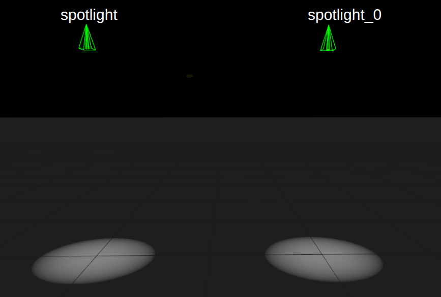
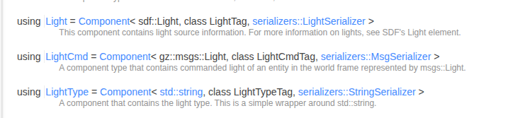
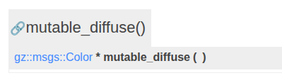
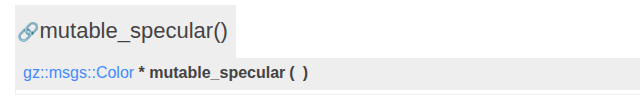

# Light Control System Plugin


<iframe
  width="960"
  height="540"
  src="https://www.youtube.com/embed/L9-3nozt4ac?si=nuf9BloEaf7h2vGa"
  title="Gazebo Sim Structure Plugin Perspective"
  frameborder="0"
  allow="accelerometer; autoplay; clipboard-write; encrypted-media; gyroscope; picture-in-picture"
  allowfullscreen>
</iframe>


In this tutorial we make a light control system plugin. Will use 2 spot light to make disco light effect



<br>

## Light Control Logic


- Read the 2 light component current value
- change only the ```diffuse & specular``` colour rgb value
- Update the colours on every loop

<br>

## How Colour Change works

[graph link](https://www.desmos.com/calculator/akwxcaxt57)


```c++

    // Animated RGB in [0,1]
    const double r = 0.5 * (1.0 + std::sin(this->time * 0.5));
    const double g = 0.5 * (1.0 + std::sin(this->time * 0.5 + 2.0));
    const double b = 0.5 * (1.0 + std::sin(this->time * 0.5 + 4.0));
    gz::math::Color newColor(r, g, b, 1.0);

```


<br>
<br>

## How To Get Multiple Entities


related api in  [EntityComponentManager class](https://gazebosim.org/api/sim/9/classgz_1_1sim_1_1EntityComponentManager.html)


```c++

//check for such components which has Light, Name components
_ecm.Each<components::Light, components::Name>(
    [&](const Entity &_entity,
        const components::Light *,
        const components::Name *_name) -> bool
    {
    this->lightEntites.push_back(_entity);
    // gzmsg << "Found light: " << _name->Data()
    //       << " (entity " << _entity << ")\n";
    return true;
    });

```


<br>
<br>

## Update Component Values

lets first see the all available [components](https://gazebosim.org/api/sim/9/namespacegz_1_1sim_1_1components.html) for light




```LightCmd``` has ```Cmd``` we can use it command/control the light plugin 

<br>

## Convert Data Type 

what is the data type of it? <br>

 ```components::Light``` -  ```sdf::Light``` data type <br>
 ```components::LightCmd``` - ```gz::msgs::Light``` data type <br>

both has a different data type means we need to convert between them


related api in [gz::sim](https://gazebosim.org/api/sim/9/namespacegz_1_1sim.html)
,[gz::msgs api](https://gazebosim.org/api/msgs/10/namespacegz_1_1msgs.html)


```c++
auto lightComp = _ecm.Component<components::Light>(e);
const sdf::v14::Light &sdfLight = lightComp->Data();

//convert sdf light msg to gz light msg
gz::msgs::Light msg = gz::sim::convert<gz::msgs::Light>(sdfLight);
```


<br>
<br>


## Set New Colour

Inside [gz::sim::light](https://gazebosim.org/api/msgs/9/classgz_1_1msgs_1_1Light.html) class


diffuses & specular both msg are of type ```gz::msgs::Color```

```c++
gz::math::Color newColor(r, g, b, 1.0);

//using Set() to set the fields of light msg
gz::msgs::Set(msg.mutable_diffuse(),  newColor);
gz::msgs::Set(msg.mutable_specular(), newColor);
```






that is why we can use ```gz::msgs::Set()```  to set ```gz::math::Color``` values


<br>
set the LightCmd Component, its same method that we dicussed in [MoveModel System Plugin](move-model.md)

```c++
//method1
// auto cmdComp = _ecm.Component<components::LightCmd>(e);
// if (!cmdComp)
//   _ecm.CreateComponent(e, components::LightCmd(msg));
// else
// {
    
//   cmdComp->Data() = msg;

    
// }

//method2
_ecm.SetComponentData<components::LightCmd>(e,msg);
```


in case of light we need to trigger update so that rendering system knows it updated but it case of all physics related plugin it auto updates like in case of Move Model velocity get auto updated.

```c++
    _ecm.SetChanged(e,
                    components::LightCmd::typeId,
                    ComponentState::PeriodicChange);
                    /// PeriodicChange ->changing periodically,ok to drop few samples
```


## Full Plugin


<details>
   <summary>plugin .sdf file</summary>

```xml
<!-- custom plugin to make disco light effect-->
<plugin
    filename="LightControl"
    name="gz::sim::LightControl">
</plugin>
```

</details>


<details>
   <summary>.hh file</summary>

```c++
#ifndef LIGHT_CONTROL_PLUGIN_HH_
#define LIGHT_CONTROL_PLUGIN_HH_

#include <gz/sim/System.hh>
#include <gz/sim/components/Name.hh>
#include <gz/sim/components/Light.hh>
#include <gz/math/Color.hh>
#include <gz/sim/Light.hh>

#include <vector>

namespace gz
{
namespace sim
{
class LightControl : public System, public ISystemPreUpdate
{
public:
  // Constructor
  LightControl() = default;

  // ISystemPreUpdate method
  void PreUpdate(const UpdateInfo &_info, EntityComponentManager &_ecm) override;

private:
  // Function to find the light entity by name
  void FindLightEntities(EntityComponentManager &_ecm);

  // Time accumulator for color cycling
  double time = 0.0;

  std::vector<Entity> lightEntites; //list of light entity
};
}  // namespace sim
}  // namespace gz

#endif

```

</details>


<details>
   <summary>.cc file</summary>

```c++
#include "tutorial_gazebo_plugins/LightControl.hh"

#include <gz/plugin/Register.hh>

#include <gz/msgs/light.pb.h>
#include <gz/msgs/Utility.hh>

#include <gz/sim/components/Light.hh>
#include <gz/sim/components/LightCmd.hh>
#include <gz/sim/components/Name.hh>

#include <sdf/Light.hh>
#include <gz/sim/Conversions.hh>


using namespace gz;
using namespace gz::sim;


// Find all light entities
void LightControl::FindLightEntities(EntityComponentManager &_ecm)
{
  this->lightEntites.clear();


  //check for such components which has Light, Name components
  _ecm.Each<components::Light, components::Name>(
      [&](const Entity &_entity,
          const components::Light *,
          const components::Name *_name) -> bool
      {
        this->lightEntites.push_back(_entity);
        // gzmsg << "Found light: " << _name->Data()
        //       << " (entity " << _entity << ")\n";
        return true;
      });
}

// ---------------------------------------------------------------------
void LightControl::PreUpdate(const UpdateInfo &_info,
                             EntityComponentManager &_ecm)
{
   if (_info.paused)
    return;

  this->time += std::chrono::duration_cast<std::chrono::duration<double>>(
                    _info.dt)
                    .count();

  this->FindLightEntities(_ecm);
  if (this->lightEntites.empty())
    return;

  //Un comment to see the flicker effect
  // Flicker (no RNG): irregular brightness 0.15..1.0
  // constexpr double kTwoPi = 6.283185307179586;
  // const double t = this->time;

  // double flicker = 0.55
  //   + 0.25 * std::sin(kTwoPi * 17.0 * t)
  //   + 0.15 * std::sin(kTwoPi * 23.0 * t + 1.7)
  //   + 0.10 * std::sin(kTwoPi * 31.0 * t + 0.3);


  // flicker = std::clamp(flicker, 0.15, 1.0);

  // // // Animated RGB in [0,1]
  // const double r = 0.5 * (1.0 + std::sin(this->time * 0.5)) * flicker;
  // const double g = 0.5 * (1.0 + std::sin(this->time * 0.5 + 2.0)) * flicker;
  // const double b = 0.5 * (1.0 + std::sin(this->time * 0.5 + 4.0)) * flicker;
  // gz::math::Color newColor(r, g, b, 1.0);

  // Animated RGB in [0,1]
  const double r = 0.5 * (1.0 + std::sin(this->time * 0.5));
  const double g = 0.5 * (1.0 + std::sin(this->time * 0.5 + 2.0));
  const double b = 0.5 * (1.0 + std::sin(this->time * 0.5 + 4.0));
  gz::math::Color newColor(r, g, b, 1.0);


 
  for (const Entity e : this->lightEntites)
  {

    //read data of Light
    auto lightComp = _ecm.Component<components::Light>(e);
    if (!lightComp)
      continue;

    const sdf::v14::Light &sdfLight = lightComp->Data();

    //convert sdf light msg to gz light msg
    gz::msgs::Light msg = gz::sim::convert<gz::msgs::Light>(sdfLight);

    //using Set() to set the fields of light msg
    gz::msgs::Set(msg.mutable_diffuse(),  newColor);
    gz::msgs::Set(msg.mutable_specular(), newColor);

    //method1
    // auto cmdComp = _ecm.Component<components::LightCmd>(e);
    // if (!cmdComp)
    //   _ecm.CreateComponent(e, components::LightCmd(msg));
    // else
    // {
      
    //   cmdComp->Data() = msg;

      
    // }

    //method2
    _ecm.SetComponentData<components::LightCmd>(e,msg);

    // in case of light we need to trigger update so that rendering system knows it updated
    _ecm.SetChanged(e,
                    components::LightCmd::typeId,
                    ComponentState::PeriodicChange);
                    /// PeriodicChange ->changing periodically,ok to drop few samples
  }
}

// Register the plugin
GZ_ADD_PLUGIN(
    LightControl,
    gz::sim::System,
    LightControl::ISystemPreUpdate)

GZ_ADD_PLUGIN_ALIAS(LightControl, "gz::sim::LightControl")

```
</details>


## flicker Effect (Disco effect)

making light intensity low/light give the disco effect


```c++

//Un comment to see the flicker effect
// Flicker (no RNG): irregular brightness 0.15..1.0
constexpr double kTwoPi = 6.283185307179586;
const double t = this->time;

double flicker = 0.55
  + 0.25 * std::sin(kTwoPi * 17.0 * t)
  + 0.15 * std::sin(kTwoPi * 23.0 * t + 1.7)
  + 0.10 * std::sin(kTwoPi * 31.0 * t + 0.3);


flicker = std::clamp(flicker, 0.15, 1.0);

// // Animated RGB in [0,1]
const double r = 0.5 * (1.0 + std::sin(this->time * 0.5)) * flicker;
const double g = 0.5 * (1.0 + std::sin(this->time * 0.5 + 2.0)) * flicker;
const double b = 0.5 * (1.0 + std::sin(this->time * 0.5 + 4.0)) * flicker;
gz::math::Color newColor(r, g, b, 1.0);

```


## Other Way Possible Using Light Class Doesn't work As Expected Why? 

```c++
auto lightObj = Light(e);
lightObj.SetDiffuseColor(_ecm, newColor); 
lightObj.SetSpecularColor(_ecm, newColor);
```

if gazebo sim github [Light.cc](https://github.com/gazebosim/gz-sim/blob/gz-sim10/src/Light.cc) actual code you will understand why


<details>
  <summary>actual api code</summary>

```c++
void Light::SetDiffuseColor(EntityComponentManager &_ecm,
   const math::Color &_color)
{
  auto lightCmd =
    _ecm.Component<components::LightCmd>(this->dataPtr->id);

  msgs::Light lightMsg;   ///problem is here it created a entire new msg
  msgs::Set(lightMsg.mutable_diffuse(), _color);
  if (!lightCmd)
  {
    _ecm.CreateComponent(
        this->dataPtr->id,
        components::LightCmd(lightMsg));
  }
  else
  {
    lightCmd->Data() = lightMsg;
  }
}
```


```c++
void Light::SetSpecularColor(EntityComponentManager &_ecm,
   const math::Color &_color)
{
  auto lightCmd =
    _ecm.Component<components::LightCmd>(this->dataPtr->id);

  msgs::Light lightMsg; ///problem is here it created a entire new msg
  msgs::Set(lightMsg.mutable_specular(), _color);
  if (!lightCmd)
  {
    _ecm.CreateComponent(
        this->dataPtr->id,
        components::LightCmd(lightMsg));
  }
  else
  {
    lightCmd->Data() = lightMsg;
  }
}

```

</details>

  ```msgs::Light lightMsg;```   problem is here it created a entire new msg means new light because of which we can change our light certain color property rather end up making new light so be very carefull using direct class of ```model,world,light``` etc


