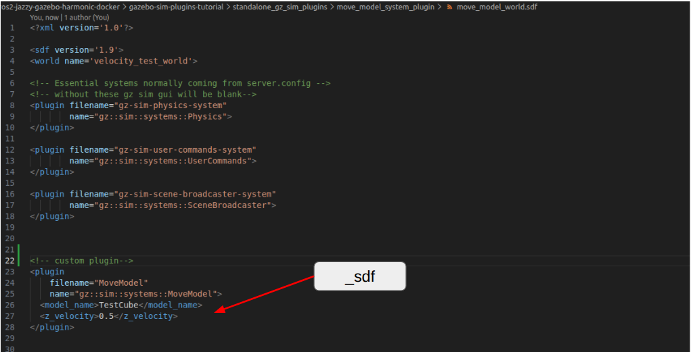

# Move Model System Plugin

<iframe
  width="960"
  height="540"
  src="https://www.youtube.com/embed/0f_C55CNQus?si=n8ltGdFQc9qMJidp"
  title="Gazebo Sim Structure Plugin Perspective"
  frameborder="0"
  allow="accelerometer; autoplay; clipboard-write; encrypted-media; gyroscope; picture-in-picture"
  allowfullscreen>
</iframe>


[MoveModel.hh](https://github.com/Hrithik-verma/gazebo-sim-plugins-tutorial/blob/main/standalone_gz_sim_plugins/print_entity_system_plugin/MoveModel.hh)

<details>
   <summary>.hh file</summary>

```c++
#ifndef SYSTEM_PLUGIN_MODEL_HH_
#define SYSTEM_PLUGIN_MODEL_HH_

//! [header]
#include <gz/sim/System.hh>  // to inherit system
#include "gz/sim/Model.hh"  // for Model component
#include "gz/sim/components/LinearVelocityCmd.hh" // for LinearVelocityCmd component
#include "gz/sim/components/Name.hh"  // for Name component
#include <gz/plugin/Register.hh> //for GZ_ADD_PLUGIN_ALIAS()


namespace gz
{
namespace sim
{
namespace systems
{
  /// \brief plugin to move a model
  /// plugin interface.
  class MoveModel :
    // This class is a system.
    public gz::sim::System,
    public gz::sim::ISystemConfigure,
    // This class also implements the ISystemPreUpdate interface.
    public gz::sim::ISystemPreUpdate
  {
   public:
    MoveModel();

    ~MoveModel() override;

    void Configure(const Entity &_entity,
                   const std::shared_ptr<const sdf::Element> &_sdf,
                   EntityComponentManager &_ecm,
                   EventManager &_eventMgr) override;

    void PreUpdate(const UpdateInfo &_info,
                  EntityComponentManager &_ecm) override;

   private:
    std::string modelName;
    double zVelocity{0.0};
    Entity targetEntity{kNullEntity};
  };
}
}
}

//! [header]

#endif

```
</details>

[MoveModel.cc](https://github.com/Hrithik-verma/gazebo-sim-plugins-tutorial/blob/main/standalone_gz_sim_plugins/print_entity_system_plugin/MoveModel.cc)


<details>
   <summary>.cc file</summary>

```c++
#include "MoveModel.hh"


using namespace gz;
using namespace sim;
using namespace systems;

MoveModel::MoveModel(){
  std::cout<<"MoveModel Plugin Started!!"<<std::endl;
}
MoveModel::~MoveModel(){
  std::cout<<"MoveModel Plugin Stopped!!"<<std::endl;
}

void MoveModel::Configure(const Entity &_entity,
    const std::shared_ptr<const sdf::Element> &_sdf,
    EntityComponentManager &_ecm,
    EventManager &/*_eventMgr*/)
{
  if (!_sdf->HasElement("model_name"))
  {
    gzerr << "ApplyZVelocityPlugin requires a <model_name> element."
          << std::endl;
    return;
  }
  this->modelName = _sdf->Get<std::string>("model_name");
  gzmsg << "Target Model Name: " << this->modelName << std::endl;

  // Read the desired Z linear velocity from SDF
  if (!_sdf->HasElement("z_velocity"))
  {
    gzerr << "ApplyZVelocityPlugin requires a <z_velocity> element."
          << std::endl;
    return;
  }
  this->zVelocity = _sdf->Get<double>("z_velocity");
  gzmsg << "Desired Z Velocity: " << this->zVelocity << " m/s" << std::endl;
}

void MoveModel::PreUpdate(const UpdateInfo &_info,
                          EntityComponentManager &_ecm)
{
  // Only run if the simulation is not paused
  if (_info.paused)
    return;

  
  //1.Find the target model entity by name (if not found yet)
  if (this->targetEntity == kNullEntity)
  {
    auto entityOpt = _ecm.EntityByName(this->modelName);
    if (!entityOpt.has_value())
    {
      gzdbg << "Model [" << this->modelName
            << "] not found yet. Skipping velocity application." << std::endl;
      return;
    }

    this->targetEntity = entityOpt.value();
    gzmsg << "Found target model entity: " << this->targetEntity << std::endl;
  }

  //method 1
  // 2.Get / create LinearVelocity component
  auto velComp =
      _ecm.Component<components::LinearVelocityCmd>(this->targetEntity);

  if (!velComp)
  {
    velComp = _ecm.CreateComponent(this->targetEntity,
                                   components::LinearVelocityCmd());
    // gzmsg << "Added LinearVelocity component to model: "
    //       << this->modelName << std::endl;
  }

  if (!velComp)
  {
    gzerr << "Failed to create/get LinearVelocity component for model ["
          << this->modelName << "]." << std::endl;
    return;
  }

  // 3.Set the Z-axis linear velocity: (0, 0, zVelocity)
  const gz::math::Vector3d vel(0.0, 0.0, this->zVelocity);
  velComp->Data() = vel;

                  /// or
                  
  // method 2
  //instate of step 2 & 3 directly run     
  // const gz::math::Vector3d vel(0.0, 0.0, this->zVelocity);     
  // _ecm.SetComponentData<components::LinearVelocityCmd>(this->targetEntity,{vel});


  // another method of using Model class a rapper around ecs
  // gz::sim::Model model(this->targetEntity);
  // model.SetLinearVel(vel) ❌ no such function exits so can't use it  \
  https://gazebosim.org/api/sim/9/classgz_1_1sim_1_1Model.html#a6ef1a8bed2d5fcc912ac23116c73ec76
  // https://gazebosim.org/api/sim/9/migrationmodelapi.html Yet in TO DO we do not need it even if you understand EntityComponentManager

}

// Register the plugin with Gazebo Sim
GZ_ADD_PLUGIN(gz::sim::systems::MoveModel,
              gz::sim::System,
              gz::sim::ISystemConfigure,
              gz::sim::ISystemPreUpdate)

GZ_ADD_PLUGIN_ALIAS(gz::sim::systems::MoveModel,
                    "gz::sim::systems::MoveModel")
```

</details>


lets understand the only the part of code which are very different from the previous Print Entity System Plugin


## sdf point to plugin in .sdf file
```c++
void MoveModel::Configure(const Entity &_entity,
    const std::shared_ptr<const sdf::Element> &_sdf,
    EntityComponentManager &_ecm,
    EventManager &/*_eventMgr*/)


```

```_sdf``` pointing to plugin tags ``` <model_name>..</model_name> ```, ```<z_velocity>...</z_velocity>``` .sdf




[sdf api](https://gazebosim.org/api/sdformat/9/classsdf_1_1v9_1_1Element.html)


```HasElement``` is used to check if it has the element or not
```get``` is used here to get the data from the element (tags)


```c++
{
  if (!_sdf->HasElement("model_name"))
  {
    gzerr << "ApplyZVelocityPlugin requires a <model_name> element."
          << std::endl;
    return;
  }
  this->modelName = _sdf->Get<std::string>("model_name");
  gzmsg << "Target Model Name: " << this->modelName << std::endl;

  // Read the desired Z linear velocity from SDF
  if (!_sdf->HasElement("z_velocity"))
  {
    gzerr << "ApplyZVelocityPlugin requires a <z_velocity> element."
          << std::endl;
    return;
  }
  this->zVelocity = _sdf->Get<double>("z_velocity");
  gzmsg << "Desired Z Velocity: " << this->zVelocity << " m/s" << std::endl;
}
```


<br>
<br>

# Find the Entity 


[gz::sim::EntityComponentManager api doc](https://gazebosim.org/api/sim/9/classgz_1_1sim_1_1EntityComponentManager.html){target=_blank}<br>
[gz::sim::components api doc](https://gazebosim.org/api/sim/9/namespacegz_1_1sim_1_1components.html){target=_blank}<br>


to find the entity value will use the Name entity

```c++
  if (this->targetEntity == kNullEntity)
  {
    auto entityOpt = _ecm.EntityByName(this->modelName);
    if (!entityOpt.has_value())
    {
      gzdbg << "Model [" << this->modelName
            << "] not found yet. Skipping velocity application." << std::endl;
      return;
    }

    this->targetEntity = entityOpt.value();
    gzmsg << "Found target model entity: " << this->targetEntity << std::endl;
  }
```

<br>

# Send Move velocity command on z axis


to move the model entity will use LinearVelocityCmd component for that will need to add the component

there are 2 working methods for it

method 1
```c++
//method 1
  // 2.Get / create LinearVelocity component
  auto velComp =
      _ecm.Component<components::LinearVelocityCmd>(this->targetEntity);

  if (!velComp)
  {
    velComp = _ecm.CreateComponent(this->targetEntity,
                                   components::LinearVelocityCmd());
    // gzmsg << "Added LinearVelocity component to model: "
    //       << this->modelName << std::endl;
  }

  if (!velComp)
  {
    gzerr << "Failed to create/get LinearVelocity component for model ["
          << this->modelName << "]." << std::endl;
    return;
  }

  // 3.Set the Z-axis linear velocity: (0, 0, zVelocity)
  const gz::math::Vector3d vel(0.0, 0.0, this->zVelocity);
  velComp->Data() = vel;

```


method 2
```c++
// method 2
  //instate of step 2 & 3 directly run     
  const gz::math::Vector3d vel(0.0, 0.0, this->zVelocity);     
  _ecm.SetComponentData<components::LinearVelocityCmd>(this->targetEntity,{vel});
```


one non working method
```c++
  // another method of using Model class a rapper around ecs
  gz::sim::Model model(this->targetEntity);
  model.SetLinearVel(vel) ❌ no such function exits so can't use it 
  // https://gazebosim.org/api/sim/9/classgz_1_1sim_1_1Model.html#a6ef1a8bed2d5fcc912ac23116c73ec76
  // https://gazebosim.org/api/sim/9/migrationmodelapi.html Yet in TO DO we do not need it even if you understand EntityComponentManager
```

```Model``` class a rapper around ecs
[gz::sim::Model](https://gazebosim.org/api/sim/9/classgz_1_1sim_1_1Model.html#a6ef1a8bed2d5fcc912ac23116c73ec76)<br>

Yet in TO DO we do not need it even if you understand EntityComponentManager

[migrationmodelapi](https://gazebosim.org/api/sim/9/migrationmodelapi.html)


Build & RUN way remains same as [pervious plugin](common-in-all-system.plugin.md)