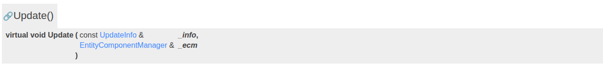
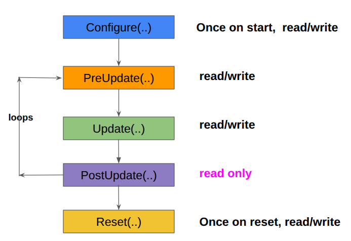

# System Plugin Intefaces

official gazebo sim doc [link](https://gazebosim.org/api/sim/8/createsystemplugins.html){target=_blank}

comman line in any system plugin

```c++
class MoveModel :
    // This class is a system.
    public gz::sim::System,
    public gz::sim::ISystemConfigure,
    public gz::sim::ISystemPreUpdate,
    //public gz::sim::ISystemUpdate,
    //public gz::sim::ISystemPostUpdate
```


```c++
// Register the plugin with Gazebo Sim
GZ_ADD_PLUGIN(gz::sim::systems::MoveModel,
              gz::sim::System,
              gz::sim::ISystemConfigure,
              gz::sim::ISystemPreUpdate)

```

``Note:`` in inheriting which class what function needs to be defined

- ```gz::sim::ISystemConfigure```  -> ```Configure()```
- ```gz::sim::ISystemPreUpdate```  -> ```PreUpdate()```
- ```public gz::sim::ISystemUpdate```  -> ```Update()```
- ```public gz::sim::ISystemPostUpdate```  -> ```PostUpdate()```


<br>
<br>
<br>

```c++
void Configure(const Entity &_entity,
                   const std::shared_ptr<const sdf::Element> &_sdf,
                   EntityComponentManager &_ecm,
                   EventManager &_eventMgr) override;

void PreUpdate(const UpdateInfo &_info,
                  EntityComponentManager &_ecm) override;

void Update(const UpdateInfo &_info, EntityComponentManager &_ecm) override;

void PostUpdate(const UpdateInfo &_info, const EntityComponentManager &_ecm) override;	
```



class api: [ISystemConfigure](https://gazebosim.org/api/sim/8/classgz_1_1sim_1_1ISystemConfigure.html){target=_blank},[ISystemPreUpdate](https://gazebosim.org/api/sim/8/classgz_1_1sim_1_1ISystemPreUpdate.html){target=_blank},[ISystemUpdate](https://gazebosim.org/api/sim/8/classgz_1_1sim_1_1ISystemUpdate.html){target=_blank}, [ISystemPostUpdate](https://gazebosim.org/api/sim/8/classgz_1_1sim_1_1ISystemPostUpdate.html){target=_blank}<br>

all of the above are [pure virtual funtion](https://www.geeksforgeeks.org/cpp/pure-virtual-functions-and-abstract-classes/){target=_blank} because of which all need to defined in the derive class


## Decide on interfaces to implement
The first step of implementing a system plugin is to determine the subset of available interfaces to implement. Aside from the base System object, there are currently four additional available interfaces:




1. ISystemConfigure<br>
    - ```read-write access```
    - ```Executed once```
    - ```SDF file``` parameters define
<br>
2. ISystemPreUpdate
    - ```read-write access```
    - ```modify state before physics runs```
<br>
3. ISystemUpdate<br>
    - ```read-write access``` 
    - Used for ```physics simulation step``` (i.e., simulates what happens at time gz::sim::UpdateInfo::simTime).
<br>
4. ISystemPostUpdate<br>
    - ```read-only access``` 
    - Used to ```read out results at the end of a simulation``` step to be used for ```sensor or controller updates```.
<br>
5. ISystemReset<br>
    - ```read-write  access```
    - ```Executed once the moment the plugin is reseted.```
