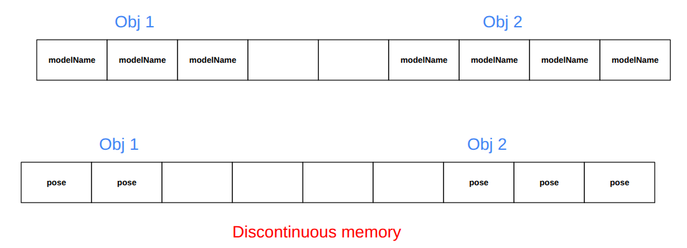
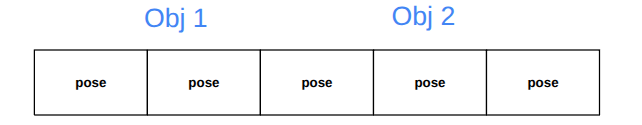

# Enitity Component System
<iframe
  width="960"
  height="540"
  src="https://www.youtube.com/embed/NfcCNiX3f1c?si=8wrzNWPkh1Pxv-TQ"
  title="Entity Component System Explained"
  frameborder="0"
  allow="accelerometer; autoplay; clipboard-write; encrypted-media; gyroscope; picture-in-picture"
  allowfullscreen>
</iframe>

## What Is ECS?
-----
<iframe
  src="https://docs.google.com/presentation/d/1qN_F4PVnxAfdK1wM0wKI_Gnp91K-S-cJ6sEKWLbVDWU/edit?usp=sharing"
  width="960"
  height="569"
  frameborder="0"
  allowfullscreen
></iframe>


## How ECS Is Fast?
-----
let understand what is the actual problem & how ecs solve it

``Modern CPUs are insanely fast at math but painfully slow at memory access``<br>

| Operation    | Approx latency       |
| ------------ | -------------------- |
| CPU register | ~1 cycle             |
| L1 cache     | ~4 cycles            |
| L2 cache     | ~12 cycles           |
| L3 cache     | ~40 cycles           |
| RAM          | **200–400 cycles** ❌ |

because RAM is slow cpu used cache for storing small data to process. 


But the problem with OOPS in traditional Object-Oriented Programming (OOP), you organize code by Objects.

eg:

```c++
class model {
    std::string modelName;     // owns heap memory (dynamic memory)
    std::vector<double> pose;  // owns heap memory (dynamic memory)
    float size[3];             // inline
    float scale[3];            // inline
};

/* 
   modelObj is contiguous in memory.
   However, std::string and std::vector store their data on the heap,
   causing pointer indirection and non-contiguous access patterns,
   which reduces cache efficiency in tight loops.
*/
model modelObj[2]; 
```



but modelName & pose are discontinuous memory because of these it cause trouble to caching<br>
``The core problem is CPU cache inefficiency caused by memory layout``


<br>
<br>
<br>

## ECS Continuous Memory 
-----
ECS we just control components & read/write on them one by one


First loop on modelName components, than loop on all Pose components<br>
Because of component now continuous memory is allocated



